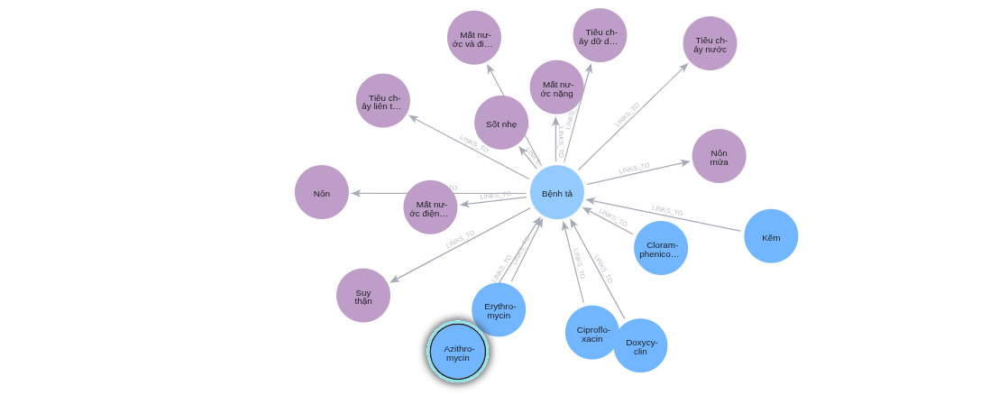
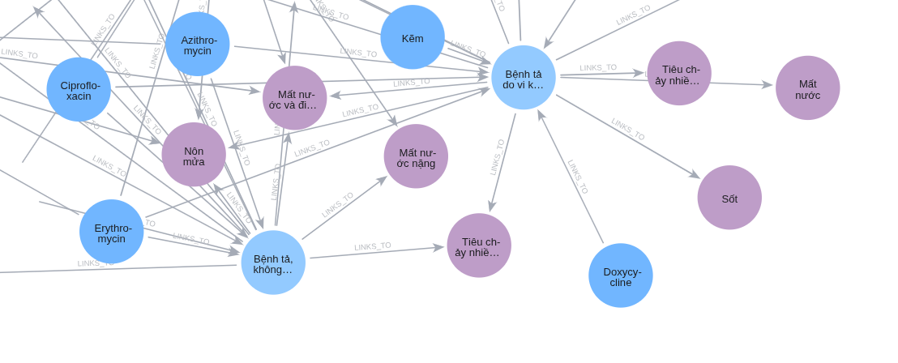

# PRIME-KG VN: Clinical Knowledge Graph (ICD-10 & OMOP CDM)

## 📝 Introduction
PRIME-KG VN (Scientific Edition) is an advanced, automated framework designed to construct a large-scale clinical knowledge graph tailored for the Vietnamese healthcare ecosystem. By integrating the localized ICD-10 disease classification matrix with standard international clinical vocabularies, this platform establishes an evidence-traceable, high-density relational network. It serves as a foundational infrastructure for clinical decision support systems, semantic medical search engines, and observational health data analytics.

Using the **ICD-10** coding system from the Vietnamese Ministry of Health as its backbone, this project creates a structured network linking diseases with tens of thousands of other medical entities (Symptoms, Drugs, Complications, etc.). Data is aggregated and automatically cleaned from official domestic and international sources. The entire graph structure is mapped to be compatible with the **OMOP CDM 5.3.1** standard.

---

## 💡 Technical Features & System Architecture

The system is built with fault-tolerant principles and rigorous data architecture:

* **Hard-Anchoring Architecture:** Unlike random graph generation systems, this platform does **NOT** use LLMs to hallucinate relationship types. Edges are mathematically defined via `RELATION_RULES`, and internal `EXCLUDES`/`INCLUDES` links are extracted directly from the WHO guidance columns in the source ICD-10 file.
* **Knowledge Hub (Deduplication):** Merges identical Nodes (based on SHA-256 hash), automatically concatenating descriptions and `evidence` from multiple articles into a single, comprehensive Node.
* **igraph & Neo4j Compatibility:** Generates continuous `node_index` values, ensuring 100% accurate `x_id`/`y_id` mapping, ready for ingestion into any graph database.
* **Anti-Crash Mechanism:** Integrates cross-audit features to resume from checkpoints on failed disease extractions. Combines auto-save per cluster and a rotating SearXNG URL algorithm to bypass rate-limiting.

---

## 🌐 5-Tier Data Pipeline & Edge Source Percentages

Web scraping is optimized using `ThreadPoolExecutor` and divided into five tiers of authority. **Notably, the system automatically translates keywords into English** when querying international tiers. 

The overall graph contains **76,415 directed edges**, distributed with precise data lineage across the following authority tiers:

1. **Tier 1 (VN Official):** `gov.vn`, `tapchiyhocduphong.vn`, `vjmed.org.vn`, `vjid.vn`, `yhth.vn`, etc.
   * **Data Contribution:** 36,269 edges (**47.46%** of the graph)
2. **Tier 2 (VN Major Hospitals & Pharmacies):** `vinmec.com`, `nhathuoclongchau.com.vn`, `medlatec.vn`, `pharmacity.vn`, `tamanhhospital.vn`, `hongngochospital.vn`, etc.
   * **Data Contribution:** 26,070 edges (**34.12%** of the graph)
3. **Tier 3 (International Academia - Auto-translated):** `ncbi.nlm.nih.gov`, `thelancet.com`, `jamanetwork.com`, `nejm.org`, `sciencedirect.com`, etc.
   * **Data Contribution:** 1,342 edges (**1.76%** of the graph)
4. **Tier 4 (Health Organizations - Auto-translated):** `who.int`, `cdc.gov`, `nih.gov`, `msdmanuals.com`, `mayoclinic.org`, `clevelandclinic.org`, `hopkinsmedicine.org`, `nhs.uk`, etc.
   * **Data Contribution:** 3,795 edges (**4.97%** of the graph)
5. **Tier 5 (Extended Sources):** Performs open-search queries if the top 4 tiers do not provide the required number of articles.
   * **Data Contribution:** 8,939 edges (**11.70%** of the graph)

---

## 🤖 Multi-Agent AI Pipeline

Instead of a single bloated prompt, the system utilizes Ollama (Qwen3-VL 8B) operating three independent agents with strict `format: json` enforcement:

1. **Agent Evaluator (Gatekeeper):** Analyzes the first 2,000 characters of the article. **Blocks** pure Veterinary documents (treating pigs, chickens, dogs, cats) with a 96% accuracy filter while remaining intelligent enough to **Allow** articles concerning Zoonotic diseases.
2. **Agent Extractor (Extraction Engine):** Conducts deep reading of up to 25,000 characters. Extracts 9 types of clinical entities, enforces translation of all data into standardized Vietnamese, and strictly mandates quoting the original text as `evidence`.
3. **Agent Reviewer (Supervisor):** Re-evaluates the extracted entities, purging hallucinations or redundant content before final graph insertion.

---

## 📊 Detailed Data Statistics & Scan Gaps

Data collection currently focuses on ICD-10 codes **A00 through G00.1**. Out of 2,872 codes within this targeted range, **1,219 diseases** have been successfully processed and verified with real web data, representing an effective range coverage of **42.44%** (approximately **7.69%** of the 15,844 total codes in the master catalog).

* **Identified Knowledge Gaps:** 1,653 codes within the scanned range are currently marked as sparse/missing due to technical constraints (such as aggregator resource overload, intermediate timeouts, structural web authentication, or a lack of qualified native-language clinical content). Specific data gaps include: `A37.0`, `A37.8`, `A49.1`, `A51.2`, `A59`, `A77.1`, `A95.0`, `B15`, `B15.0`, `B15.9`, `B18.2`, and the `B20.0` through `B20.8` series.

### 1. Node Distribution
The graph is categorized into 9 primary clinical entity types (Total: **32,163 Nodes**):

| Entity Type | Concept | Count | Percentage (%) |
| :--- | :--- | :--- | :--- |
| **RiskFactor** | Risk Factors | 4,974 | 15.46% |
| **Symptom** | Clinical Symptoms | 4,832 | 15.02% |
| **Intervention** | Medical Interventions | 4,618 | 14.36% |
| **Disease** | Disease (ICD-10) | 4,232 | 13.16% |
| **Complication** | Complications | 3,894 | 12.11% |
| **Demographic** | Demographics | 3,474 | 10.80% |
| **DiagnosticTest**| Tests / Diagnostics | 2,620 | 8.15% |
| **Pathogen** | Pathogens | 1,861 | 5.79% |
| **Drug** | Medications | 1,658 | 5.15% |

### 2. Graph Density Analysis
For the 1,219 diseases with real-world data, the graph achieves high connectivity: **60.31 links / Disease**. On average, a single disease code is connected to:
`11.0 Symptoms` | `8.6 Complications` | `8.6 Risk Factors` | `8.5 Interventions` | `7.8 Demographics` | `6.1 Diagnostic Tests` | `4.9 Drugs` | `4.3 Pathogens`.

---
### 3.4 Semantic Mapping to the OMOP CDM for Clinical Querying

The OMOP Common Data Model version 5.3.1, developed by the Observational Health Data Sciences and Informatics (OHDSI) community, provides a standard for integrating healthcare data from multiple sources. To bridge the gap between theoretical medical knowledge and real-world evidence, our knowledge graph serves as a semantic layer rather than a direct physical storage unit. 

Table 2 maps the vertices and edges of the KG to the corresponding OMOP clinical event tables, establishing a **Query Mapping Framework**.

**Table 2. Query Mapping of KG entities to OMOP CDM clinical event tables**

| Source Node Type | Relation | Target Node Type | Target OMOP Clinical Table (Query Mapping) |
| :--- | :--- | :--- | :--- |
| **Drug** | `TREATS` | **Disease** | `drug_exposure` |
| **Intervention** | `PART_OF_TREATMENT` | **Disease** | `procedure_occurrence` |
| **RiskFactor** | `INCREASES_RISK_OF` | **Disease** | `observation` |
| **Pathogen** | `CAUSES` | **Disease** | `specimen` / `observation` |
| **Demographic** | `AFFECTS_POPULATION` | **Disease** | `concept` |
| **Disease** | `HAS_SYMPTOM` | **Symptom** | `observation` |
| **Disease** | `DIAGNOSED_BY` | **DiagnosticTest** | `measurement` |
| **Disease** | `HAS_COMPLICATION` | **Complication** | `condition_occurrence` |

By defining this structural correspondence, the KG acts as an intelligent routing mechanism. For instance, when a `Drug` is linked to a `Disease` via the `TREATS` relationship in the graph, the system explicitly knows to target the `drug_exposure` table in a hospital's relational database to extract actual patient treatment records. Thanks to this mapping, the constructed knowledge graph can be readily integrated with existing healthcare data systems (electronic health records, observational studies) and can leverage OHDSI analytical tools such as ATLAS, Achilles, and Circe.
---

## 🕸️ Graph Visualization (Neo4j)

### 1. Macroscopic View
The panoramic view clearly demonstrates the complex interconnections between various disease families. Diseases do not exist in isolation; they share common entity sets (symptoms, drugs), creating knowledge clusters that support differential diagnosis.

### 2. Microscopic View
Deep-diving into a specific node, such as code **A00.0 (Cholera due to Vibrio cholerae 01, biovar cholerae)**, reveals a star-network structure:

From the central Disease node, the system retrieves symptoms (vomiting, diarrhea, dehydration), medications, and hierarchical `IS_SUBTYPE_OF` relationships pointing back to the parent disease (Cholera A00).

---

## 🛠️ Clinical Mining & Lookup Applications

The practical utility of the generated graph structure has been validated across key clinical exploration scenarios:
* **Disease Suggestion via Symptom Profiling:** When provided with input manifestations such as *diarrhea, vomiting, cramps, and dehydration*, a priority matching algorithm successfully surfaces and ranks Cholera-related codes at the top based on density containment: `A00.9` (81.82%), `A00.0` (75.00%), and `A00` (80.00%).
* **Evidence-Linked Treatment Retrieval:** Querying a disease node like Cholera (`A00`) yields a structured array of active medications (**Azithromycin**, **Ciprofloxacin**, **Chloramphenicol**, **Doxycycline**, **Erythromycin**, **Zinc**) paired directly with their parsed text segments containing concrete therapeutic dosage constraints and source URLs.

---

## 📂 Project Structure & Execution

* `run_crawl.py`: Core Script (Scientific Edition) controlling the data scraping flow, Ollama integration, and graph construction.
* `icd10_danh_muc.csv`: Contains the original ICD-10 master list.
* `analyze.py`: Analysis script for statistics, density metrics, and graph coverage (Gaps).
* `edges.zip`: Directory containing results (`edges.csv`, `nodes_*.csv`, and `raw_sources.jsonl` logs).
